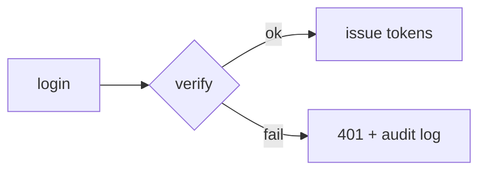

# 技术方案:认证

## 选型

JWT(access 2h + refresh 7d),argon2id 哈希。不引 session 存储,网关无状态。

## 流程

```mermaid
graph LR
  A[login] --> B{verify}
  B -- ok --> C[issue tokens]
  B -- fail --> D[401 + audit log]
```

## 边界

- 刷新接口限流 5/min/IP
- 审计日志独立表,只追加
